# Pulse Scan — руководство пользователя

Версия программы: **0.9.0-rc1** (релиз-кандидат) · октябрь 2026

Pulse Scan превращает записи сканера **Pulse** (лидар Velodyne VLP-16 на поворотной платформе) в единое облако точек объекта. В одной программе:

1. **импорт** записей прямо со сканера по сети или из папки;
2. **стыковка** сканов между собой: автоматически, по группам, вручную;
3. **контроль** качества, сечения, замеры;
4. **чистка** отражений, движущихся объектов и лишнего;
5. **результат**: экспорт облака (E57, PLY, PCD) и экспериментальной поверхности (OBJ, PLY, STL).

---

## Содержание

1. [Установка](#1-установка)
2. [Быстрый старт](#2-быстрый-старт)
3. [Окно программы](#3-окно-программы)
4. [Проект](#4-проект)
5. [Импорт](#5-импорт)
6. [Дерево проекта](#6-дерево-проекта)
7. [Стыковка](#7-стыковка)
8. [Контроль: качество, сечения, замеры](#8-контроль-качество-сечения-замеры)
9. [Чистка](#9-чистка)
10. [Результат: экспорт и поверхность](#10-результат-экспорт-и-поверхность)
11. [Передача проекта другому человеку](#11-передача-проекта-другому-человеку)
12. [Калибровка лидара](#12-калибровка-лидара)
13. [Клавиши и мышь](#13-клавиши-и-мышь)
14. [Неполадки и вопросы](#14-неполадки-и-вопросы)
15. [Ограничения версии и планы](#15-ограничения-версии-и-планы)
16. [Термины](#16-термины)

---

## 1. Установка

### Требования

| | macOS | Windows |
|---|---|---|
| Система | macOS 12 и новее, **Apple Silicon** (M1 и новее) | Windows 10 / 11, 64 бит |
| Видеокарта | встроенная | поддержка OpenGL 3.2 (любая видеокарта последних 10 лет) |
| Память | 8 ГБ, для больших объектов 16 ГБ | то же |
| Диск | ~1 ГБ на программу + место под записи и сканы (≈ 100 МБ на запись, ≈ 10–25 МБ на скан) | то же |

Для импорта прямо со сканера компьютер и сканер должны быть в одной сети.

### macOS

1. Откройте файл `PulseScan-…-macOS-arm64.dmg`.
2. Перетащите **Pulse Scan** на ярлык **Программы**.
3. **Первый запуск.** Программа пока не подписана сертификатом Apple, поэтому macOS скажет, что не может проверить разработчика. Откройте «Программы», щёлкните по **Pulse Scan** правой кнопкой → **Открыть** → **Открыть**. Дальше программа будет запускаться обычным двойным щелчком.

   Если вместо этого появляется «Программа повреждена», выполните в Терминале:
   ```
   xattr -dr com.apple.quarantine "/Applications/Pulse Scan.app"
   ```

### Windows

1. Распакуйте `PulseScan-…-Windows-x64.zip` в любую папку, например `C:\Программы\Pulse Scan`. **Не запускайте программу прямо из zip-архива.**
2. Запустите **Pulse Scan.exe**.
3. Если SmartScreen пишет «Windows защитила ваш компьютер», нажмите **Подробнее → Выполнить в любом случае**. Программа пока не подписана.

### Где программа хранит данные

| Что | Где |
|---|---|
| Записи, скачанные со сканера (без открытого проекта) | `~/Pulse/bags` (Windows: `C:\Users\<имя>\Pulse\bags`) |
| Записи, скачанные при открытом проекте | папка `bags` рядом с файлом проекта |
| Сканы, построенные из записей | папка `scans` рядом с проектом |
| Скриншоты | `~/Pulse/Скриншоты` |
| Настройки (тема, размер точек, адрес сканера) | системные настройки пользователя |

---

## 2. Быстрый старт

Типичный путь от записей на сканере до готового облака:

1. **«Проект» → «Новый».**
2. **«Проект» → «Со сканера»**: отметьте записи нужного дня → **«Скачать и импортировать»**. Записи скачаются и превратятся в сканы, затем пройдёт анализ и автостыковка.
3. Проверьте результат в **3D-виде** и таблице **«Пары»**: все сканы должны получить статус «размещён».
4. Неразмещённые сканы (обычно фасады) состыкуйте вручную: **«Стыковка» → «Ручная»**, потом **«Автоподгонка»** → **«Принять позу»**.
5. **«Стыковка» → «По горизонту»** и **«План по стенам»**.
6. **«Контроль» → «Качество совмещения»**: красным подсвечиваются места, где сканы расходятся.
7. **«Чистка» → «Найти»** (движущиеся объекты) → **«Удалить найденное»**. Лишнее убирается **«Рамкой»**.
8. **«Проект» → «Сохранить»** (файл `.pulse`).
9. **«Результат» → «Экспорт склейки»** → E57 / PLY / PCD.

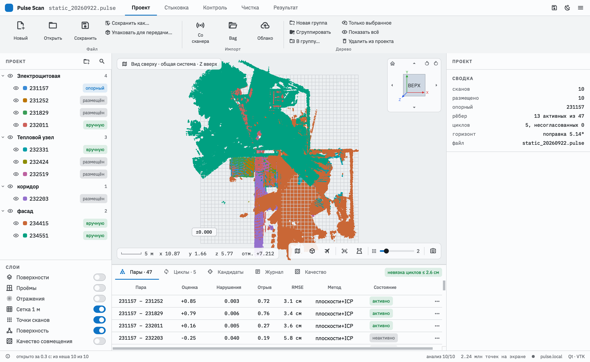

---

## 3. Окно программы

| Область | Что там |
|---|---|
| **Лента** (сверху) | Вкладки по этапам работы: **Проект → Стыковка → Контроль → Чистка → Результат**. На ленте — команды. |
| **Дерево проекта** (слева) | Сканы, группы, построенные поверхности; глаз — видимость. |
| **Слои** (слева внизу) | Что показывать поверх облаков: найденные поверхности и проёмы, отражения, сетку 1 м, точки сканов, поверхность, качество совмещения. |
| **3D-вид** (в центре) | Облака точек. Сверху — режим вида и куб навигации, снизу — координаты и инструменты вида. |
| **Нижняя панель** | Вкладки **Пары**, **Циклы**, **Кандидаты**, **Журнал**, **Качество**. |
| **Правая панель** | Параметры и состояние текущей вкладки: сведения о скане, ручная стыковка, контроль, чистка, поверхность. |
| **Строка состояния** | Что происходит, прогресс фоновых задач, число точек, адрес сканера. |

Вкладка ленты открывает свою правую панель: «Чистка» — панель чистки, «Результат» — поверхность, «Контроль» — нулевой уровень, сечения и замеры. Двойной щелчок по вкладке сворачивает ленту, чтобы освободить место под 3D-вид.

### Вкладки ленты

**Проект** — файл, импорт, работа с деревом:
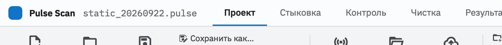

**Стыковка** — автоматическая, по группам, ручная, граф, горизонт и план:
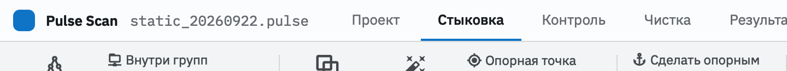

**Контроль** — качество совмещения, объекты, сечения, нулевой уровень, замеры:
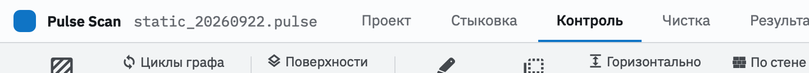

**Чистка** — движущиеся объекты, отражения, рамка:
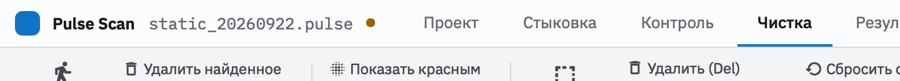

**Результат** — экспорт облака, поверхность, скриншот:
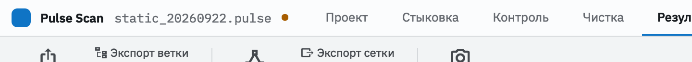

Справа на ленте всегда видны **Сохранить**, **Тема** (светлая / тёмная) и **меню ☰**: файл, руководство (F1), клавиши, «О программе».

### Навигация в 3D-виде

| Действие | Мышь / клавиши |
|---|---|
| Вращение вокруг вертикали | левая кнопка + тянуть |
| Сдвиг | правая или средняя кнопка (или Shift + левая) + тянуть |
| Масштаб к точке под курсором | колесо |
| Центр вращения — в точку облака | двойной щелчок по облаку |
| Вид сверху | **T** или кнопка на плашке внизу |
| Вид 3D | кнопка на плашке или ⌂ у куба |
| Полёт по объекту | **F**: W/A/S/D — ходьба, Space/E — вверх, C/Q — вниз, мышь — обзор, колесо — скорость, Shift — быстрее, Esc — выход |
| Перспектива / ортогональная проекция | **O** или кнопка на плашке |
| Размер точек | ползунок на плашке или **[** и **]** |
| Показать всё | кнопка на плашке |

### Куб навигации

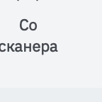

- **Щелчок по грани** даёт строгий вид по осям: «Верх» — X вправо, Y вверх; боковые грани — Z вверх. Щелчок по ребру или углу — вид наискосок.
- **↺ / ↻** — повернуть вид на 90° вокруг оси взгляда (для вида сверху — повернуть план на экране).
- **▲ ▼ ◀ ▶** — перейти к соседней грани.
- **⌂** — вид 3D.
- Куб можно тянуть мышью — это то же вращение вида.

---

## 4. Проект

Проект — файл **`.pulse`**. В нём:
- позы сканов и связи между ними;
- дерево групп и видимость;
- ручная чистка;
- нулевой уровень, сечение, замеры;
- **кеш анализа**: найденные поверхности, проёмы, отражения. Благодаря кешу проект открывается за секунды без повторного анализа.

**Сами облака точек в `.pulse` не хранятся.** Проект ссылается на файлы сканов: пути записаны относительно файла проекта. Держите проект и папку `scans` вместе. Для передачи другому человеку есть упаковка — раздел 11.

| Команда | Где |
|---|---|
| Новый проект | «Проект» → «Новый», Ctrl/⌘+N |
| Открыть | «Проект» → «Открыть», Ctrl/⌘+O; на macOS — двойной щелчок по файлу `.pulse` |
| Сохранить | «Сохранить», Ctrl/⌘+S |
| Сохранить как… | Ctrl/⌘+Shift+S; формат `.pulse` (с кешем) или `.json` (без кеша, для совместимости) |

**Оранжевая точка** рядом с именем проекта означает несохранённые изменения. При закрытии программа предложит сохранить их.

**Опорный скан** задаёт систему координат проекта: остальные сканы размещаются относительно него. По умолчанию опорный — первый скан. Сменить его: правая кнопка на скане → **«Сделать опорным»**.

---

## 5. Импорт

### 5.1. Со сканера по сети

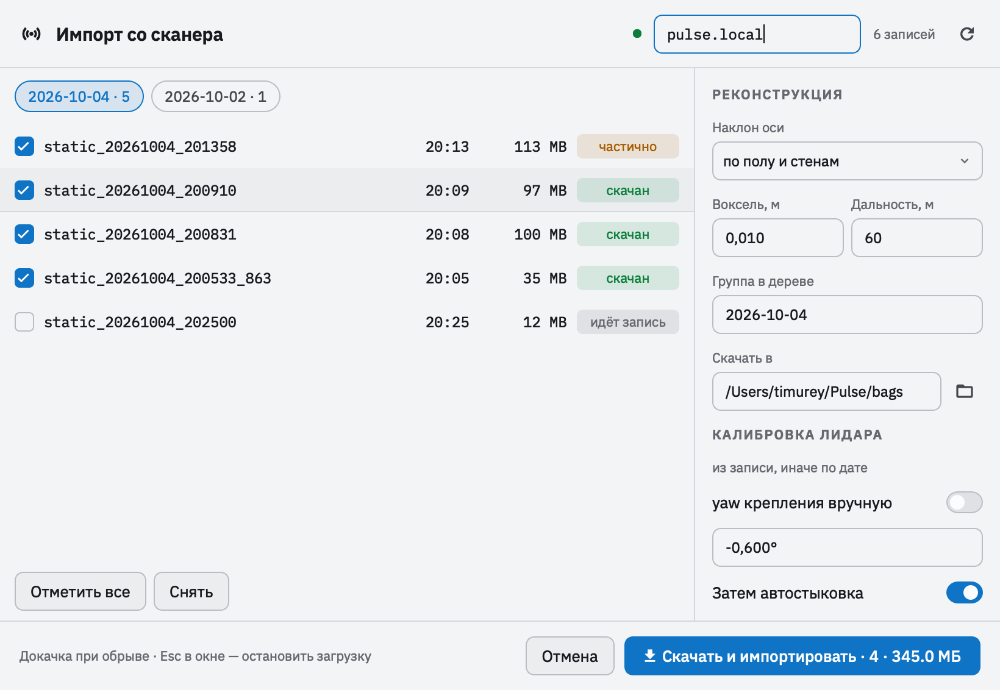

1. **«Проект» → «Со сканера».**
2. Адрес сканера по умолчанию — **`pulse.local`**. Если имя не находится, введите IP-адрес сканера и нажмите ⟳ или Enter. Зелёная точка означает, что связь есть.
3. Выберите **день съёмки** (кнопки сверху) и отметьте записи. «Отметить все» отмечает все записи дня. Запись, которая идёт прямо сейчас, недоступна.
4. Состояния записей:
   - **новый** — ещё не скачан;
   - **скачан** — уже есть на компьютере;
   - **частично** — загрузка прерывалась, продолжится с места остановки.
5. Справа — параметры реконструкции (раздел 5.3) и папка для записей.
6. **«Скачать и импортировать»**. Остановить загрузку можно клавишей **Esc** в главном окне. Повторный импорт докачает оставшееся.

### 5.2. Из папки с записями (bag)

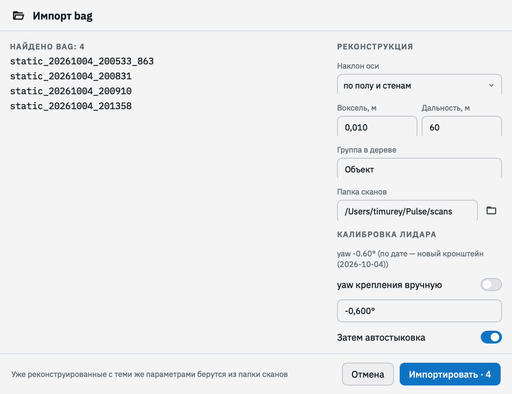

**«Проект» → «Bag»** → выберите папку одной записи или папку, в которой лежат несколько записей, например скопированную со сканера флешкой.

Готовое облако (`.e57`, `.ply`, `.pcd`, `.las`) добавляется кнопкой **«Проект» → «Облако»**.

### 5.3. Параметры реконструкции

Запись (bag) содержит сырые измерения лидара и угол поворота платформы. При импорте из них строится облако одной точки стояния. Параметры:

| Параметр | Что значит | По умолчанию |
|---|---|---|
| **Наклон оси** | Как исправить наклон оси вращения: **по полу и стенам** (по геометрии скана), **по калибровке устройства**, по IMU, не исправлять | по полу и стенам |
| **Воксель** | Прореживание: в каждом кубике этого размера остаётся одна точка | 1 см |
| **Дальность** | Точки дальше не берутся | 60 м |
| **Группа в дереве** | В какую группу положить новые сканы | день съёмки или имя папки |
| **Калибровка лидара** | Углы крепления лидара: из записи, иначе по дате записи; можно задать yaw вручную (раздел 12) | авто |
| **Затем автостыковка** | Сразу после анализа запустить автостыковку | вкл. |

Одна запись обрабатывается примерно за 5–10 с. Готовые сканы сразу появляются в дереве и 3D-виде, затем в фоне идёт **анализ**: поиск плоскостей, проёмов, отражений. Ход анализа виден в строке состояния. Пока анализ скана не закончен, его нельзя стыковать вручную.

Если записи уже реконструированы с теми же параметрами и той же калибровкой, импорт возьмёт готовые сканы из папки `scans`. Если параметры или калибровка изменились, скан пересчитается.

---

## 6. Дерево проекта

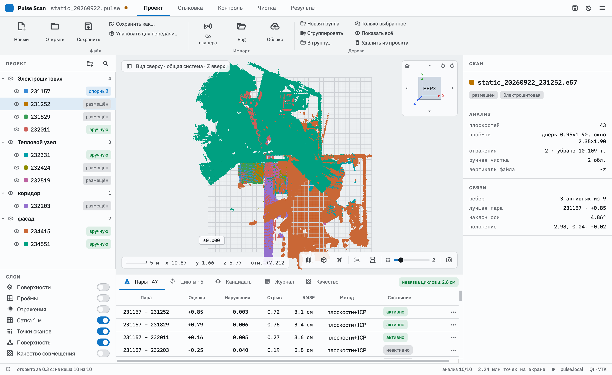

Дерево помогает организовать объект: **здание → этаж → помещение**. На геометрию оно не влияет, зато ускоряет и упрощает стыковку: можно стыковать по группам.

**Статус скана** (справа в строке):
- **опорный** — задаёт систему координат;
- **размещён** — встал автоматически;
- **вручную** — размещён ручной стыковкой;
- **не размещён** — позы пока нет. Такой скан показывается в точке опорного сканера.

**Глаз** скрывает или показывает скан либо всю группу.

**Выделение:** щелчок; **Shift** — диапазон; **Ctrl** (на macOS **⌘**) — по одному.

| Действие | Как |
|---|---|
| Новая группа | значок папки над деревом или правая кнопка → «Новая группа» |
| **Группа из выделенных** | выделите сканы → **Ctrl/⌘+G** или правая кнопка → «Сгруппировать выделенные» |
| Переместить | перетащить мышью: **между строками** — на это место (порядок), **на группу** — в её конец; или правая кнопка → «Переместить в группу…» |
| Переименовать группу | правая кнопка → «Переименовать» |
| Удалить группу | «Удалить группу» — содержимое переходит к родителю; «Удалить группу вместе со сканами…» |
| **Удалить скан из проекта** | правая кнопка → «Удалить из проекта…» или **Ctrl/⌘+Delete**. Файл скана на диске остаётся |
| Показать только это | правая кнопка → «Показать только это / выделенные»; вернуть — «Показать всё» |
| Подлететь камерой | двойной щелчок по строке |
| Фильтр по имени | значок лупы над деревом |

В правой панели показываются сведения о выбранном скане: параметры реконструкции (кадры, обороты, наклон, калибровка лидара), анализ (плоскости, проёмы, отражения, чистка) и связи.

---

## 7. Стыковка

**Стыковка** — поиск взаимного положения сканов. Программа ищет одни и те же стены, пол и потолок в разных сканах, подбирает поворот и сдвиг, а затем уточняет их по точкам (ICP). Каждая найденная **пара** — связь между двумя сканами. Из всех связей программа собирает общую картину (граф поз) и сводит её так, чтобы ошибки распределились равномерно.

### 7.1. Автостыковка

**«Стыковка» → «Автостыковка».** Меню у кнопки (▾):
- **Использовать уже посчитанные пары** — не пересчитывать найденное ранее (быстрее);
- **По дереву** — пары только внутри групп и между соседними группами вместо всех со всеми. Сильно быстрее на больших объектах.

**Внутри групп.** Выделите группу в дереве → «Внутри групп» (или правая кнопка на группе → «Автостыковка внутри группы»). Стыкуются только сканы этой группы, включая подгруппы, остальные связи не трогаются. Если ничего не выделено, стыковка идёт внутри каждой группы по отдельности.

**Группы между собой.** Каждая группа считается жёстким целым и стыкуется с другими группами. Если в дереве выделена группа, стыкуются её подгруппы, иначе — группы верхнего уровня. Удобно, когда помещения уже состыкованы внутри, а между собой ещё нет.

### 7.2. Пары и циклы


Таблица **«Пары»** на нижней панели:

| Колонка | Значение | Хорошо |
|---|---|---|
| **Оценка** | совпадение точек минус штраф за противоречия | > 0,5 |
| **Нарушения** | доля точек, попавших туда, где другой скан видел пустое пространство | < 0,02 |
| **Отрыв** | насколько лучшее решение лучше второго по качеству (однозначность) | > 0,5 |
| **RMSE** | средняя ошибка точек после ICP | 2–4 см |
| **Состояние** | активно / неактивно / принято / отклонено / вручную | — |

Пары с плохими показателями программа **не использует**: состояние «неактивно». Щелчок по строке показывает только эти два скана (Esc возвращает видимость). Меню «…» у строки:
- **Принять** — использовать пару, даже если автоматика её отвергла;
- **Отклонить** — не использовать, даже если автоматика её приняла;
- **Как решит автоматика**;
- **Ручная стыковка этой пары**.

**Циклы.** Если сканы связаны по кругу (A–B–C–A), ошибки по кругу должны сходиться. Вкладка **«Циклы»** показывает невязку каждого цикла, а плашка справа — максимальную. Невязка до нескольких сантиметров — норма. Несогласованный цикл означает, что одна из пар в нём ошибочна: найдите её и отклоните.

### 7.3. Ручная стыковка

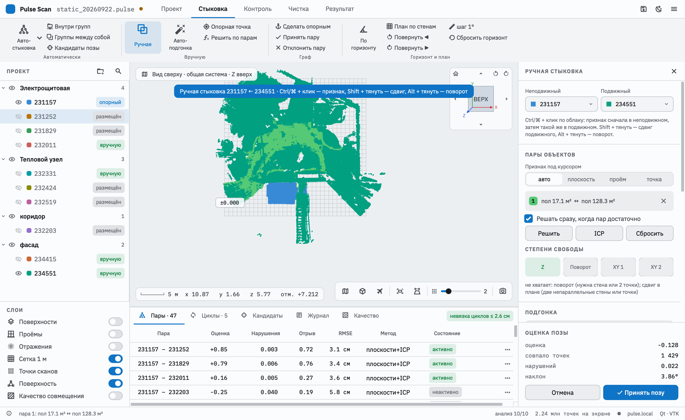

Нужна, когда автоматика не справилась: фасады, мало общих стен, сильные изменения обстановки.

1. Выделите скан в дереве → **«Стыковка» → «Ручная»**. Справа выберите **неподвижный** (уже размещённый) и **подвижный** скан.
2. **Пары объектов.** **Ctrl/⌘ + щелчок** по облаку: сначала по объекту в неподвижном скане, затем по **тому же** объекту в подвижном. Объект — найденная плоскость (стена, пол, потолок), проём (окно, дверь) или точка; выбор задаётся переключателем «Признак под курсором».
3. **Степени свободы** показывают, чего ещё не хватает:
   - **Z** — высота (пол или потолок);
   - **Поворот** — стена или две точки;
   - **XY 1, XY 2** — две непараллельные стены или точки.

   Когда всё определено, поза решается автоматически («Решать сразу») или кнопкой «Решить».
4. **Подвижка вручную:**
   - **Shift + тянуть** — сдвиг подвижного скана в плане;
   - **Alt + тянуть** (или Shift + правая кнопка) — поворот вокруг вертикали;
   - кнопки X± / Y± / Z± / yaw / крен / тангаж с выбранным шагом (1 / 5 / 20 см; 0,1 / 1 / 5°).
5. **«По горизонту»** выравнивает наклон подвижного скана по полу и стенам. **«По стенам»** доворачивает его, чтобы стены стали параллельны стенам соседей.
6. **Оценка позы** (внизу панели) — совпадение с уже размещёнными сканами. **«Принять позу»** добавляет ручную связь.

Если выйти из ручной стыковки, не приняв изменённую позу, программа спросит: принять, не принимать или остаться.

### 7.4. Автоподгонка после грубой стыковки

Грубо совместили вручную, а по полу или стенам видно, что неточно? Нажмите **«Стыковка» → «Автоподгонка»**. Программа уточнит позу по точкам: захватывает расхождение до 60 см, затем уточняет на 25 и 8 см. В разделе «Подгонка» видно **расхождение поверхностей** до и после, например «21,4 см → 0,9 см».

- **«к неподвижному»** (по умолчанию) — подгонка к одному скану, лучше для фасадов;
- **«ко всем размещённым»** — ко всем сразу.

После автоподгонки связь при «Принять позу» получает **повышенный вес**: при сведении графа ошибки уходят в грубые связи, а точная остаётся точной.

Для уже размещённого скана: правая кнопка → **«Уточнить стыковку»**. Откроется ручная стыковка с соседом и сразу запустится автоподгонка.

### 7.5. Опорная точка и транспортиры

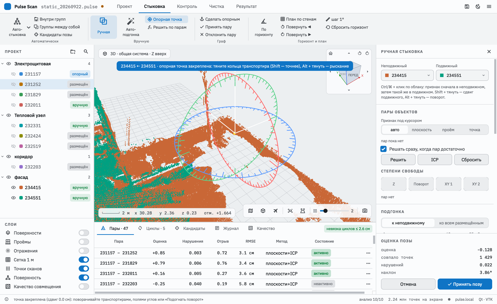

Точный способ, когда известна одна общая характерная точка, например угол здания:

1. В ручной стыковке нажмите **«Опорная точка»** (лента «Стыковка»).
2. **Ctrl/⌘ + щелчок** по точке в неподвижном скане, затем по той же точке в подвижном. Скан сдвинется, точки совпадут, и опорная точка **закрепится**: дальше скан только поворачивается вокруг неё, сдвиг заблокирован.
3. Поворачивать можно так:
   - **транспортиры** — три кольца вокруг точки: синее — вокруг Z (рыскание), красное — вокруг X (крен), зелёное — вокруг Y (тангаж). Тяните кольцо мышью; с **Shift** — в 10 раз точнее. Деления — 5°, 15°, 90°, жёлтая дуга показывает текущий угол;
   - **поля углов** с точностью до 0,001° и кнопки −/+;
   - **«Автоподгонка»** — ICP, который меняет только поворот вокруг точки.
4. «Снять точку» освобождает сдвиг. «Принять позу» — как обычно.

### 7.6. Кандидаты позы

**«Стыковка» → «Кандидаты позы»** для выбранного неразмещённого скана: программа предлагает несколько вариантов позы (вкладка «Кандидаты»). Щелчок по строке показывает вариант, **«Принять»** — применить, **«Доработать вручную»** — открыть ручную стыковку с этой позы.

### 7.7. Горизонт и план

- **«По горизонту»** — выровнять весь проект по полу и стенам: убирает общий наклон, например от наклона IMU сканера. «Сбросить горизонт» — отменить.
- **«План по стенам»** — повернуть план так, чтобы стены шли вдоль осей X и Y.
- **«Повернуть ◀ ▶»** с шагом 0,1 / 1 / 5° — довернуть план вручную.

Эти команды меняют только систему координат проекта, взаимное положение сканов не меняется.

---

## 8. Контроль: качество, сечения, замеры

### 8.1. Качество совмещения

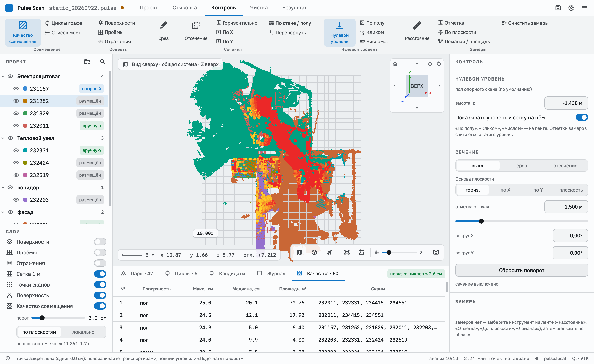

**«Контроль» → «Качество совмещения»** (или слой с тем же названием). Программа ищет места, где одна и та же поверхность из разных сканов «толще» порога, то есть сканы расходятся. Такие места подсвечиваются: от жёлтого (у порога) до красного (втрое толще).

- **Порог** — ползунок 0,5–15 см, по умолчанию 3 см. Меняется мгновенно.
- **Способ:**
  - **по плоскостям** — стены, пол, потолок из разных сканов сравниваются по участкам 20 см; наглядно видно, где именно стены расходятся;
  - **локально** — по всем плоским участкам облака, в том числе небольшим.
- **Вкладка «Качество»** на нижней панели — список проблемных мест: поверхность, максимальная и средняя толщина, площадь, сканы. Щелчок подводит камеру к месту.

Обычно светятся места ручной стыковки и участки, где между съёмками что-то сдвинули.

### 8.2. Сечения

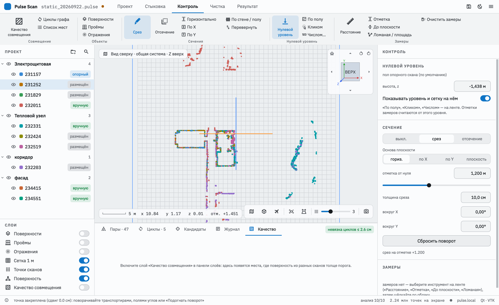

- **«Срез»** — видна только полоса облака у плоскости, заданной толщины. Горизонтальный срез на отметке +1,200 в виде сверху даёт **план этажа**, вертикальный — **разрез**.
- **«Отсечение»** — скрыто всё по одну сторону плоскости, например **выше 2,5 м**: виден интерьер без потолка. «Перевернуть» показывает другую сторону.

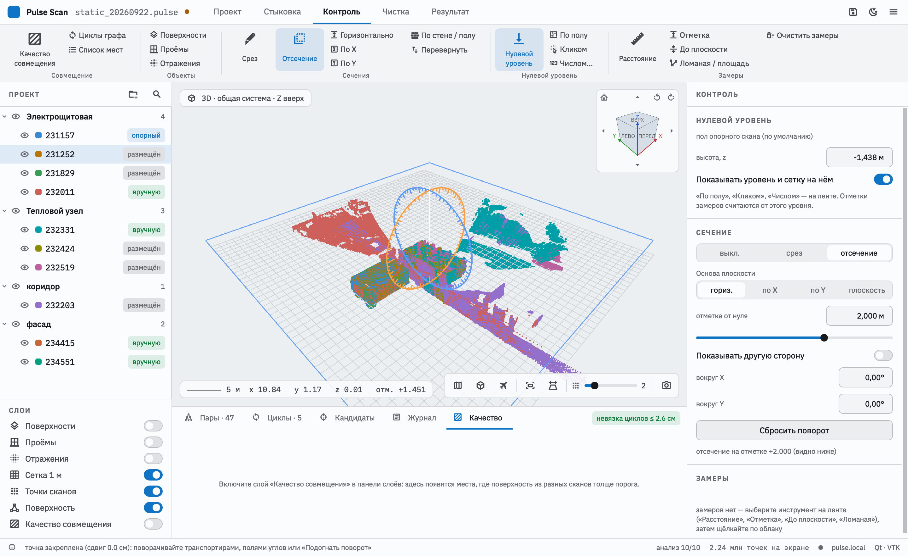

**Основа плоскости:** **горизонтально** (положение — отметка от нулевого уровня), **по X**, **по Y** или **по стене / полу** — щёлкните по найденной стене или полу, и плоскость встанет параллельно ей.

**Положение** задаётся полем или ползунком. **Доворот** — двумя транспортирами в 3D-виде (тянуть мышью) или полями углов. «Сбросить поворот» возвращает основу.

Сечение влияет только на показ. На экспорт оно не действует. Замеры ставятся только на видимые точки, поэтому на срезе удобно мерить по контуру стен.

### 8.3. Нулевой уровень

От **нулевого уровня** считаются отметки высоты. По умолчанию это **пол опорного скана**. Другие способы:
- **«Кликом»** — щёлкните точку облака, её высота станет ±0.000;
- **«Числом…»** — ввести высоту;
- **«По полу»** — вернуть пол опорного скана.

Сетка 1 м лежит на нулевом уровне, отметка точки под центром вида показана в плашке координат («отм. +1,193»).

### 8.4. Замеры

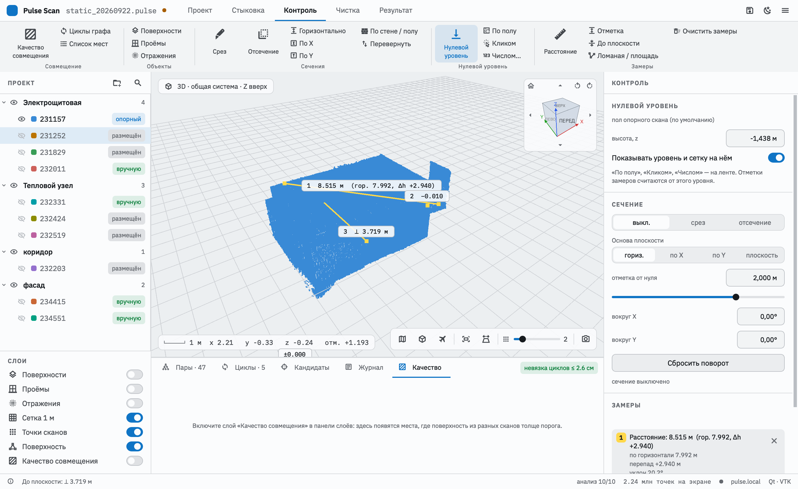

Выберите инструмент на ленте («Контроль» → «Замеры») и щёлкайте по облаку. Точка ставится **щелчком без перетаскивания**: перетаскивание по-прежнему вращает вид.

| Замер | Как | Результат |
|---|---|---|
| **Расстояние** | две точки | длина, по горизонтали, перепад высоты, уклон, отметки концов |
| **Отметка** | одна точка | высота от нулевого уровня (+2.450 / −0.150) |
| **До плоскости** | щелчок по стене / полу, затем по точке | расстояние по перпендикуляру (толщина стены, ширина прохода) |
| **Ломаная / площадь** | точки подряд; **щелчок по первой точке** замыкает контур; двойной щелчок или **Enter** — закончить | длина, углы; у замкнутой — площадь (и площадь в плане) |

Подписи замеров видны прямо в 3D-виде, подробности — в правой панели. Там же любой замер можно удалить. **Esc** отменяет незаконченный замер. Замеры и нулевой уровень сохраняются в проекте.

---

## 9. Чистка

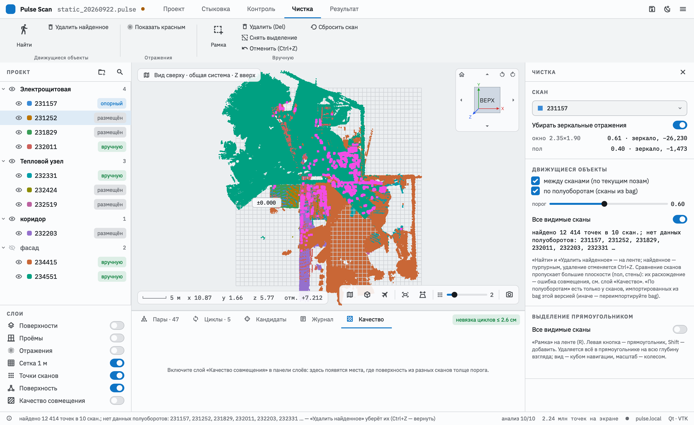

Чистка не удаляет данные из файлов сканов: удалённое запоминается в проекте и применяется при показе, стыковке и экспорте. Любое удаление отменяется **Ctrl/⌘+Z**. «Сбросить скан» снимает всю ручную чистку выбранного скана.

### 9.1. Зеркальные отражения

Стёкла и глянцевый пол дают «призраки»: за окном появляется зеркальная копия комнаты. Программа находит их автоматически и по умолчанию убирает (переключатель «Убирать зеркальные отражения»). В правой панели — отчёт по окнам и полу. **«Показать красным»** показывает, что именно убрано.

### 9.2. Движущиеся объекты

Люди, открытые или закрытые двери, машины — точки, которые не подтверждаются. **«Чистка» → «Найти»**, найденное подсвечивается пурпурным, затем **«Удалить найденное»**.

Программа использует два признака:
- **между сканами** — точка лежит там, где соседний скан видел пустое пространство. Работает для любых сканов, но только в зоне перекрытия;
- **по полуоборотам** — каждое направление сканер видит много раз за запись; то, что было лишь на части проходов, двигалось. Работает и для одиночного скана, но только для сканов, импортированных из записей этой версией программы.

**Порог** (0,30–0,95): меньше — найдёт больше, но и больше лишнего. «Все видимые сканы» — искать во всех, иначе только в выбранном.

### 9.3. Рамка

**«Чистка» → «Рамка»** (клавиша **R**): тяните прямоугольник левой кнопкой, **Shift** — добавить к выделению. Удаляется всё внутри прямоугольника **на всю глубину взгляда**, поэтому выберите удобный вид (сверху, сбоку) кубом навигации. **Delete** — удалить выделенное, **Esc** — снять выделение или выйти из режима. «Все видимые сканы» — чистить все, иначе только выбранный скан.

---

## 10. Результат: экспорт и поверхность

### 10.1. Экспорт облака

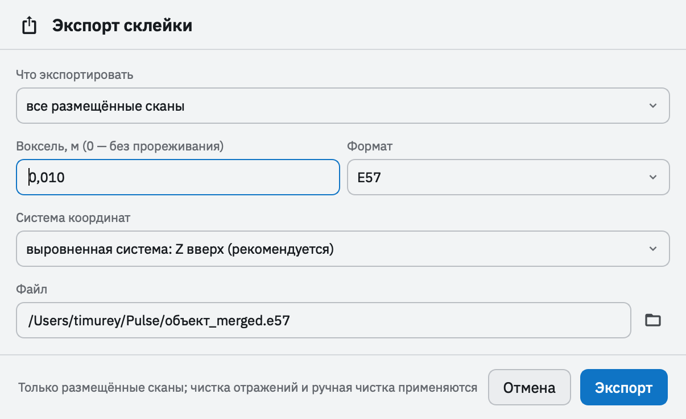

**«Результат» → «Экспорт склейки»**:

| Параметр | Варианты |
|---|---|
| Что | все размещённые сканы или ветка дерева («Экспорт ветки» — по выделенной группе / скану) |
| Воксель | прореживание итогового облака, 0 — без прореживания |
| Формат | **E57** (рекомендуется для CAD / BIM: Revit, AutoCAD, Archicad), **PLY**, **PCD** |
| Система координат | **выровненная: Z вверх** (рекомендуется: с поправкой горизонта и плана) или исходная система опорного скана |

В экспорт идут точки **полного разрешения** с учётом чистки (отражения, движущиеся объекты, рамка). Неразмещённые сканы не экспортируются.

### 10.2. Поверхность (экспериментально)

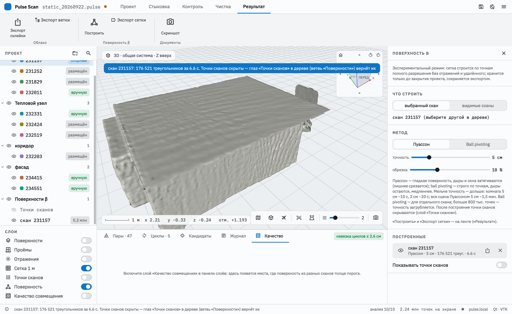

**«Результат» → «Построить»** строит треугольную сетку по точкам. Параметры — в правой панели:
- **что:** выбранный скан или все видимые сканы;
- **метод:**
  - **Пуассон** — гладкая замкнутая поверхность; лишнее над окнами и дырами срезается;
  - **ball pivoting** — строго по точкам, дыры остаются; медленный, подходит для одного скана;
- **точность:** 1–20 см;
- **обрезка** (Пуассон) — доля самых «неуверенных» участков, которые удаляются.

Время: комната при 5 см — около 10 с, при 2 см — около 20 с; весь объект Пуассоном при 5 см — около 1,5 мин. **«Остановить»** (или Esc) прерывает расчёт.

После построения **точки сканов скрываются**, иначе сетка в них не видна. Сетки появляются в дереве проекта в ветви **«Поверхности β»**:
- глаз — показать или скрыть сетку;
- строка **«Точки сканов»** — вернуть облака;
- правая кнопка — **«Экспорт сетки…»** (OBJ, PLY, STL) или **«Удалить»**.

Включение глаза любого скана тоже возвращает точки.

**Сетки не сохраняются в проекте** — только экспортом.

### 10.3. Скриншот

**F12** или кнопка «Скриншот» сохраняет снимок окна и 3D-вида в `~/Pulse/Скриншоты`.

---

## 11. Передача проекта другому человеку

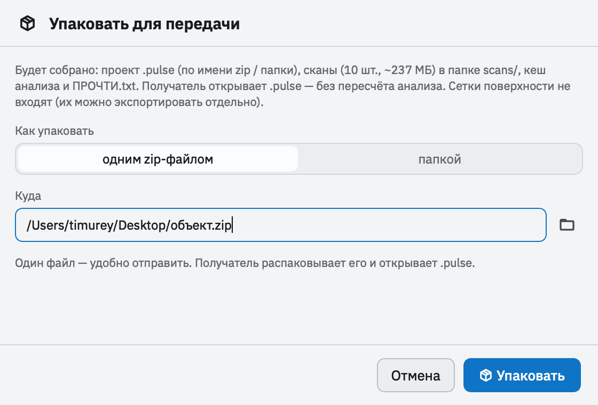

**«Проект» → «Упаковать для передачи…»**:
- **одним zip-файлом** — удобно отправить;
- **папкой** — удобно сразу продолжить работу (папка должна быть новой или пустой).

В пакет попадают проект `.pulse`, все сканы в папке `scans/`, кеш анализа и файл `ПРОЧТИ.txt`. Получатель распаковывает архив и открывает `.pulse` в Pulse Scan: проект открывается без повторного анализа, в любой системе. Открытый у вас проект упаковка не меняет. Сетки поверхности в пакет не входят, их можно экспортировать отдельно.

---

## 12. Калибровка лидара

Углы крепления лидара к поворотной платформе — **характеристика устройства**. Неверный угол даёт **двоение стен**: две половины оборота платформы ложатся со сдвигом. После замены кронштейна угол нужно откалибровать заново. Калибровка делается **на сканере** (веб-интерфейс) по записи в помещении с хорошо видимыми стенами, 6–10 оборотов, без людей в кадре.

При импорте Pulse Scan берёт калибровку:
1. **из самой записи**, если сканер её туда записал;
2. иначе **по дате записи** — по встроенной таблице (до 3 октября 2026 года — прежний кронштейн, yaw −1,6°; с 3 октября — новый, yaw −0,6°);
3. поверх можно задать **yaw вручную** в окне импорта.

Применённая калибровка показана в окне импорта и в сведениях о скане. Если сменить калибровку, при следующем импорте сканы пересчитаются.

---

## 13. Клавиши и мышь

На macOS вместо **Ctrl** используется **⌘**.

| Клавиши | Действие |
|---|---|
| Ctrl+N / Ctrl+O / Ctrl+S / Ctrl+Shift+S | новый / открыть / сохранить / сохранить как |
| F1 | руководство |
| F12 | скриншот |
| T | вид сверху |
| O | перспектива / ортогональная проекция |
| F | полёт (W A S D, Space/E, C/Q, Shift; Esc — выход) |
| [ и ] | размер точек |
| R | выделение рамкой (чистка) |
| Delete | удалить выделенное рамкой |
| Ctrl+Z | отменить удаление (чистка) |
| Ctrl+G | группа из выделенных в дереве |
| Ctrl+Delete | удалить выделенные сканы из проекта |
| Enter | закончить ломаную (замер) |
| Esc | отменить текущее: загрузку, полёт, выделение, замер, незаконченную пару |

| Мышь | Действие |
|---|---|
| левая + тянуть | вращение вида |
| правая / средняя + тянуть, Shift + левая | сдвиг вида |
| колесо | масштаб к курсору (в полёте — скорость) |
| двойной щелчок | центр вращения в точку облака |
| Ctrl/⌘ + щелчок | (ручная стыковка) выбрать объект / опорную точку |
| Shift + тянуть | (ручная стыковка) сдвиг подвижного скана |
| Alt + тянуть, Shift + правая | (ручная стыковка) поворот подвижного скана |
| тянуть кольцо транспортира | поворот вокруг опорной точки / доворот сечения; с Shift — точнее |

---

## 14. Неполадки и вопросы

**Сканер не находится по адресу `pulse.local`.** Проверьте, что компьютер и сканер в одной сети. На Windows имя `.local` иногда не разрешается — введите IP-адрес сканера (виден на экране сканера или в роутере).

**«Сканер не отдаёт файлы записей — обновите веб-HMI».** Программное обеспечение сканера устарело. Обновите его или скопируйте записи вручную и импортируйте через «Bag».

**Скан не размещается автоматически.** Возможны причины:
- мало общих стен с остальными сканами;
- сильные изменения обстановки между съёмками;
- скан снаружи (фасад).

Что делать: проверьте таблицу «Пары» — может быть, нужную пару стоит «Принять». Или состыкуйте вручную (7.3–7.5).

**Стены двоятся внутри одного скана.** Неверная калибровка крепления лидара (раздел 12) или ошибка синхронизации времени на сканере.

**После построения поверхности пропали облака.** Это сделано специально. Глаз «Точки сканов» в ветви «Поверхности β» дерева вернёт их.

**Неразмещённый скан стоит не на месте.** Это нормально: у него ещё нет позы, он показан в точке опорного сканера.

**Программа медленно открывает проект.** Первое открытие нового проекта включает анализ сканов, примерно 1–3 с на скан. Сохраните проект в `.pulse`: анализ попадёт в кеш, и следующее открытие займёт секунды.

**Чёрный 3D-вид (Windows).** Обновите драйвер видеокарты: нужен OpenGL 3.2. На удалённом рабочем столе и виртуальных машинах без видеокарты 3D-вид может не работать.

**Где журнал действий?** Вкладка «Журнал» на нижней панели.

---

## 15. Ограничения версии и планы

Версия **0.9.0-rc1** — релиз-кандидат: все функции на месте, идёт проверка на реальных объектах.

**Известные ограничения:**
- программа не подписана сертификатами Apple / Microsoft, поэтому при первом запуске появляются предупреждения (раздел 1);
- macOS — только Apple Silicon;
- сетки поверхности живут до закрытия проекта (сохраняются экспортом);
- замеры и сечения хранятся в системе координат проекта: после «По горизонту», «План по стенам» или смены опорного скана они останутся на прежнем месте относительно экрана, а не облака;
- калибровка лидара в самих записях появится после обновления программного обеспечения сканера; до этого используется таблица по датам.

**Планы:**
- **экспорт в DXF** (и подобные форматы для САПР): план этажа по горизонтальному срезу, разрезы, контуры стен, замеры;
- отчёт о качестве (PDF / HTML) рядом с экспортом;
- автоматическое дерево по меткам помещений, заданным при съёмке;
- сохранение сеток в проекте.

---

## 16. Термины

| Термин | Значение |
|---|---|
| **Запись (bag)** | файл измерений сканера на одной точке стояния (формат MCAP) |
| **Скан** | облако точек одной точки стояния, построенное из записи |
| **Точка стояния** | место, где стоял сканер на штативе |
| **Стыковка (регистрация)** | поиск взаимного положения сканов |
| **Поза** | положение и поворот скана в системе проекта |
| **Опорный скан** | скан, задающий систему координат проекта |
| **Пара, связь** | найденное взаимное положение двух сканов |
| **Граф поз** | все связи вместе; из них вычисляются позы сканов |
| **Цикл, невязка** | замкнутая цепочка связей; невязка — насколько она не сходится |
| **ICP** | уточнение позы подгонкой точек одного облака к поверхности другого |
| **Воксель** | кубик заданного размера: при прореживании в каждом остаётся одна точка |
| **Нулевой уровень** | плоскость, от которой считаются отметки высоты |
| **Склейка** | итоговое облако из всех размещённых сканов |
